# LetsLearnOS

LetsLearnOS is an open-source, touch-first learning kiosk for young children.
It combines deterministic educational activities, local progress tracking, a
restricted Chromium kiosk, and optional OpenAI text-to-speech narration.

The learning experience works without an internet connection. OpenAI narration
is an opt-in enhancement; when it is disabled or unavailable, the app uses the
device's browser speech engine.

**[Explore LetsLearnMoreOS and play the no-save demo →](https://letslearnmore-os.zeblawton.chatgpt.site)**

LetsLearnMoreOS (LLM OS) is an adult-facing project tour for parents, educators,
and contributors. Its six-experience sampler covers math, planets, rocket
launch, the globe, fire safety, and countries without saving game progress; the
child learning interface remains offline-first and chat-free.

<p align="center">
  <a href="https://letslearnmore-os.zeblawton.chatgpt.site">
    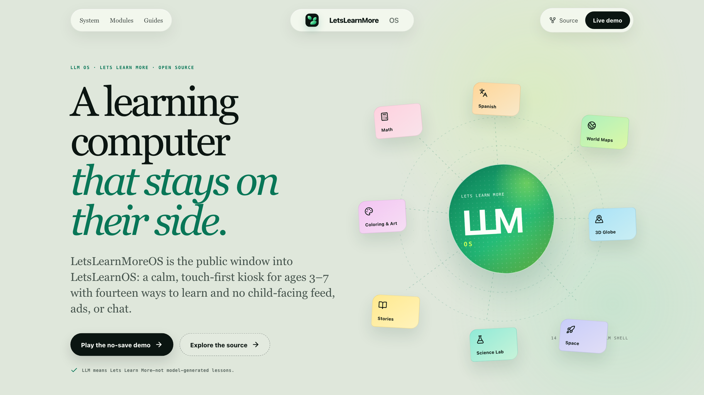
  </a>
</p>

<table>
  <tr>
    <td width="50%" valign="top">
      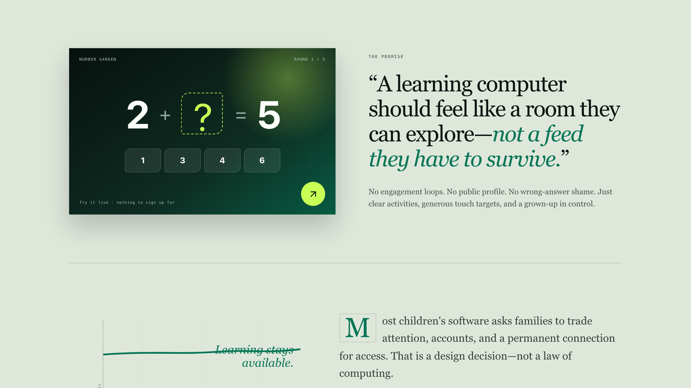
      <br><sub><b>A room to explore.</b> Clear activities, generous touch targets, and no engagement loops.</sub>
    </td>
    <td width="50%" valign="top">
      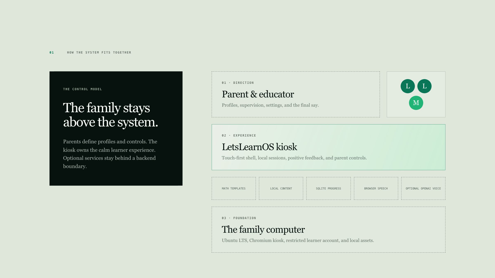
      <br><sub><b>Inspectable architecture.</b> Parent direction stays above the kiosk, local services, and optional OpenAI voice.</sub>
    </td>
  </tr>
  <tr>
    <td width="50%" valign="top">
      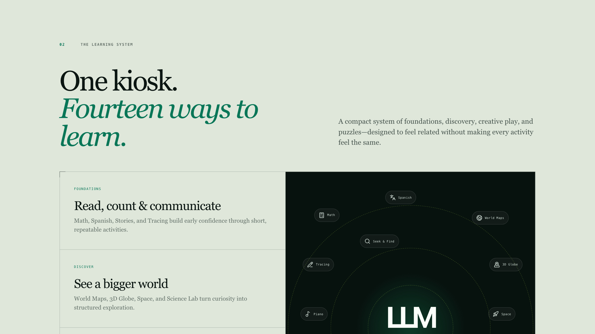
      <br><sub><b>Fourteen ways to learn.</b> A connected system of foundations, discovery, creative play, and puzzles.</sub>
    </td>
    <td width="50%" valign="top">
      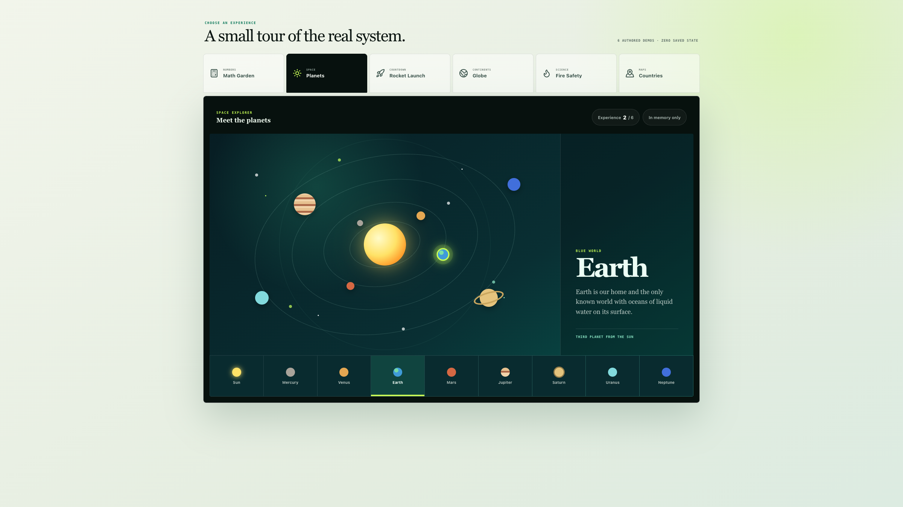
      <br><sub><b>A real no-save sampler.</b> Six deterministic mini-experiences that reset completely on reload.</sub>
    </td>
  </tr>
</table>

## Inside the kiosk

<p align="center">
  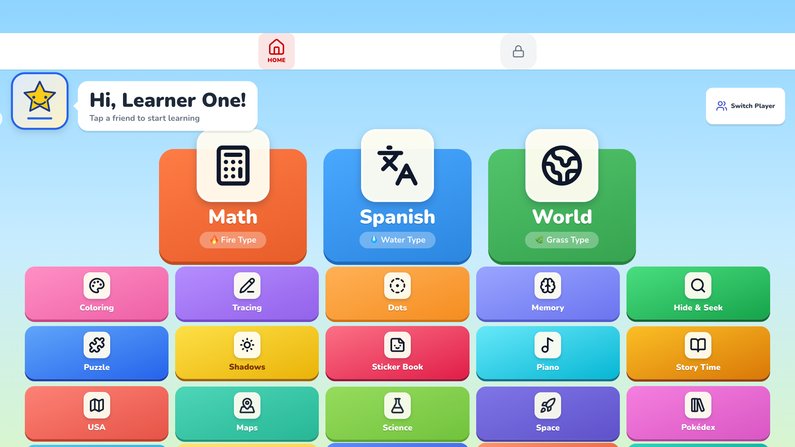
</p>

## Highlights

- Math, Spanish, geography, space, science, stories, art, puzzles, memory,
  music, worksheets, mazes, and seek-and-find activities.
- React 19/Vite frontend and Express 5 backend in a pnpm monorepo.
- Postgres for hosted development and SQLite for a standalone kiosk.
- Ubuntu kiosk/ISO scripts for an x86_64 laptop or 2-in-1.
- No child-facing AI chat and no AI-generated math or lessons.
- No API credentials, proprietary character art, or commercial music in the
  public source tree.

## See it in action

<table>
  <tr>
    <td width="50%" valign="top">
      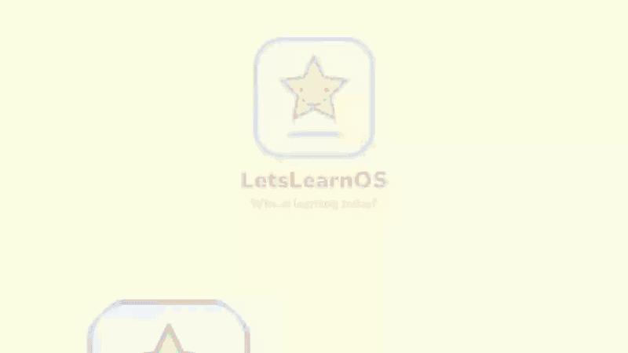
      <br><sub><b>Explore the world.</b> Choose a learner, open the globe, and move between continents.</sub>
    </td>
    <td width="50%" valign="top">
      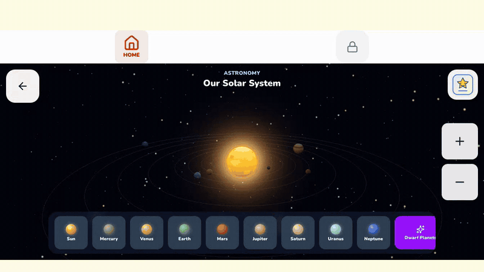
      <br><sub><b>Journey through space.</b> Visit Earth, inspect the solar system, and start a rocket countdown.</sub>
    </td>
  </tr>
</table>

The gallery uses synthetic sample profiles, permissively licensed interface
icons, and the repository's public-safe fallback artwork. It contains no
credentials, private endpoints, or redistribution-restricted assets.

## Learning experiences

<table>
  <tr>
    <td width="50%" valign="top">
      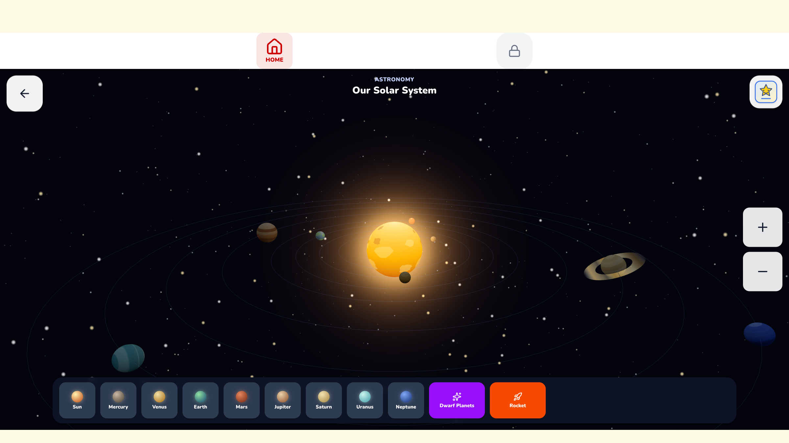
      <br><sub><b>Interactive astronomy</b> with orbiting planets, facts, zoom controls, and large touch targets.</sub>
    </td>
    <td width="50%" valign="top">
      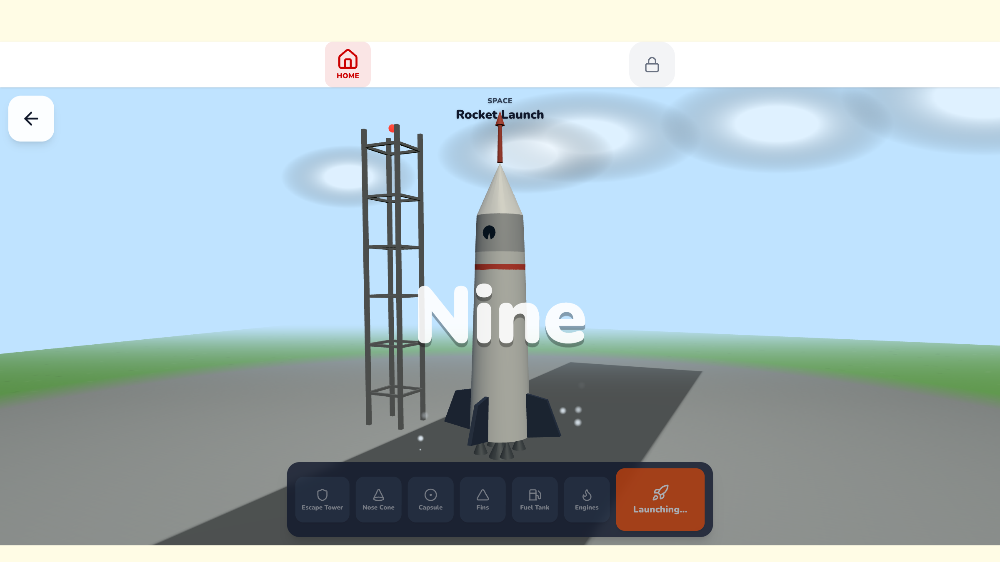
      <br><sub><b>Launch a rocket</b> with an explorable 3D model, spoken countdown, liftoff, and positive celebration.</sub>
    </td>
  </tr>
  <tr>
    <td width="50%" valign="top">
      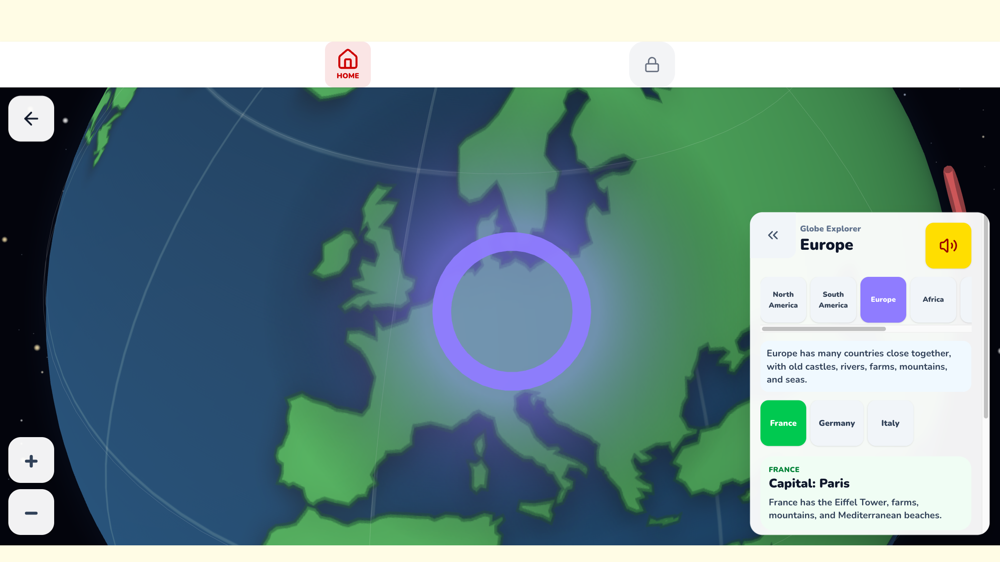
      <br><sub><b>Explore the globe</b> with continent controls, country facts, narration, and 3D movement.</sub>
    </td>
    <td width="50%" valign="top">
      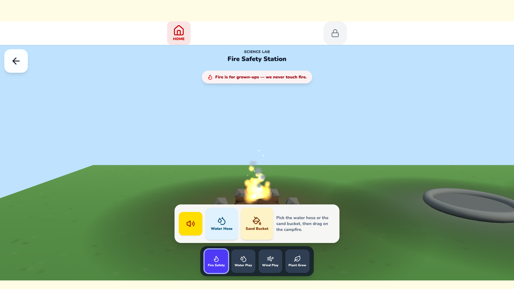
      <br><sub><b>Hands-on science</b> with a 3D fire-safety scene and positive, age-appropriate guidance.</sub>
    </td>
  </tr>
</table>

## Develop locally

Requirements: Node.js 22 and pnpm 10.

```bash
pnpm install
cp .env.example .env
pnpm run typecheck
pnpm --filter @workspace/letslearnos dev
```

Start the API in a second terminal after configuring `DATABASE_URL` and `PORT`:

```bash
pnpm --filter @workspace/api-server dev
```

Production checks:

```bash
python3 scripts/waldo-pack.py --check
python3 scripts/verify-assets.py --repository
pnpm run typecheck
pnpm --filter @workspace/api-server test
pnpm --filter @workspace/letslearnos build
pnpm --filter @workspace/api-server build
```

Native release dependencies are pinned for Linux x64. GitHub Actions is the
authoritative build environment when developing on another architecture.

## Optional OpenAI narration

1. Create an API key in the OpenAI API dashboard and enable API billing.
   ChatGPT subscriptions and OpenAI API billing are separate.
2. Copy `.env.example` to `.env`.
3. Set `OPENAI_API_KEY` in `.env` on the server or kiosk.
4. Restart the backend.

The default model is `gpt-4o-mini-tts` with the `marin` voice. Model, voice,
style instructions, project, organization, and cache directory can be changed
with the documented `OPENAI_TTS_*` variables in `.env.example`.

The key is loaded only by the Express backend. Never put it in Vite variables,
browser code, local storage, query strings, screenshots, or committed files.
When OpenAI narration is enabled, the parent UI clearly identifies the voice as
AI-generated.

Advanced server deployments can inject an externally issued short-lived
`OPENAI_ACCESS_TOKEN` instead; it takes precedence over `OPENAI_API_KEY`. This
project does not attempt to reuse a ChatGPT browser session or implement a
general “Sign in with ChatGPT” flow.

Official references: [API authentication](https://developers.openai.com/api/reference/overview#authentication),
[text-to-speech](https://developers.openai.com/api/docs/guides/text-to-speech),
and [ChatGPT/API billing separation](https://help.openai.com/en/articles/8156019-how-can-i-move-my-chatgpt-subscription-to-the-api).

## Optional local asset packs

The public repository deliberately omits proprietary character artwork and
commercial music. Missing character art uses
`artifacts/letslearnos/public/sprites/fallback.svg`; missing music is silent.

Administrators who have redistribution or personal-use rights may add a local
asset pack before building:

```text
artifacts/letslearnos/public/sprites/official-artwork/<numeric-id>.png
artifacts/letslearnos/public/audio/<track-name>.mp3
```

Then regenerate and verify the manifest:

```bash
python3 scripts/generate-asset-manifest.py
python3 scripts/verify-assets.py --repository
```

Do not commit an asset pack unless every included file is legally
redistributable under the repository's license.

## Kiosk and ISO

- Existing Ubuntu installation: `docs/kiosk-deployment.md`
- Reproducible persistent USB image: `iso/README.md`
- Parent operation: `docs/parent-guide.md`
- Architecture and security: `docs/architecture.md`, `SECURITY.md`

Host-changing scripts are intended for a human administrator to review and run.
They are never executed automatically by repository agents.

## License and trademarks

Source code is licensed under the MIT License; see `LICENSE`.

LetsLearnOS is not affiliated with Nintendo, Game Freak, The Pokémon Company,
or OpenAI. Third-party names and marks belong to their respective owners. The
public repository contains no third-party character artwork or commercial
music. OpenAI is an optional API provider, not a sponsor or endorser.
